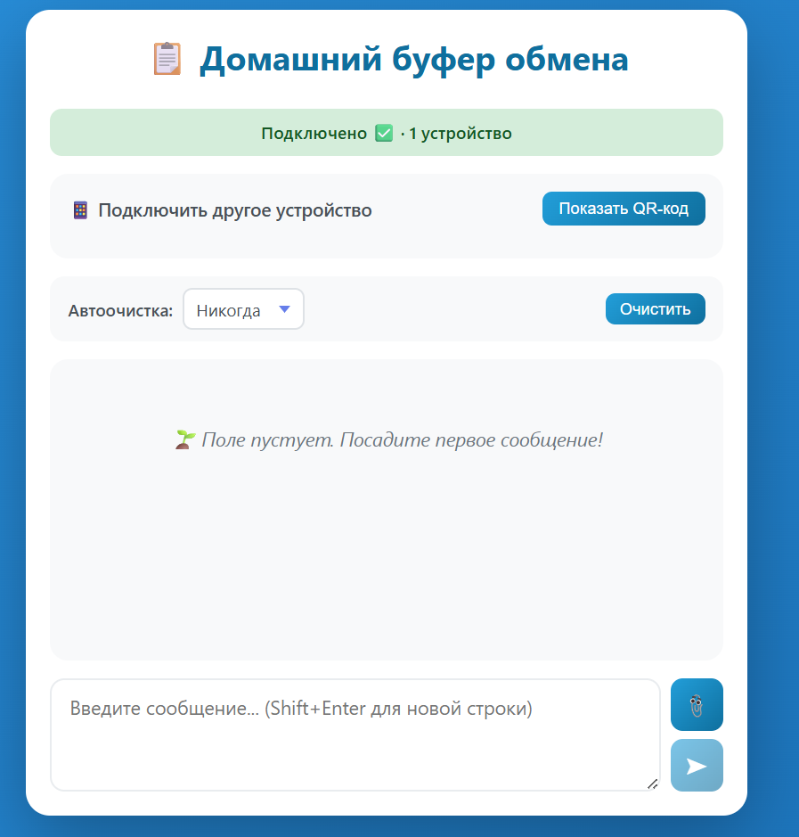

# Домашний буфер обмена 📋

Простое и элегантное приложение для обмена сообщениями и чата в локальной сети. Обменивайтесь текстом и файлами между устройствами в вашей локальной сети без подключения к интернету.

<p align="center">


</p>

## Особенности

- 🔄 Обмен текстом в реальном времени через WebSocket
- ​​📎 Поддержка обмена и загрузки файлов
- 📱 Работает на любом устройстве с браузером (настольный компьютер, мобильный телефон, планшет)
- 🌐 Не требует интернета - работает только в локальной сети
- 💾 Хранение в оперативной памяти (очищается при остановке сервера)
- 📋 Копирование в буфер обмена одним щелчком мыши
- 🔒 Только локальная сеть - данные не покидают вашу сеть

## Сборка

### Необходимые условия

- Установить Golang 1.24.0 или более новую
- Устройства, подключенные к одной локальной сети

### Запуск

```bash
# Показать все доступные команды
make help
```
```bash
# Установить зависимости
go mod download
```

```bash
# Ссылка в qr-code и порт обязательно
make run BASE_URL="http://buffer.lan" PORT=2000
```

### build (сборка)

отредактируйте файл [make](Makefile), в поле `build:` раскомментируйте ту версию, которая подходит для вашей архитектуры процессора, по умолчанию я оставил armv7

После сборки

```bash
# Сделать исполняемым файлом
chmod +x ./local-clipboard-*

# Запустить сервер (порт по умолчанию 2000)
./local-clipboard-*

# Или с пользовательским портом
./local-clipboard-* -port 3000
```

### HOST

В файле main.go вы можете изменить переменную [HOST](main.go), чтобы изменить поведение сервера (127.0.0.1 -  только внутренний доступ, 0.0.0.0 - общий доступ)


### Разработка в автономном режиме

Если вам нужно работать в автономном режиме, вы можете добавить зависимости в каталог `vendor/`:

```bash
go mod vendor
```

Это загрузит все зависимости в каталог `vendor/` для использования в автономном режиме.

Наслаждайтесь домашним буфером обмена! 🎉


### HTTPS

Ветка `https` содержит версию https для глобального интернета, в локальной сети пока не тестировалась.